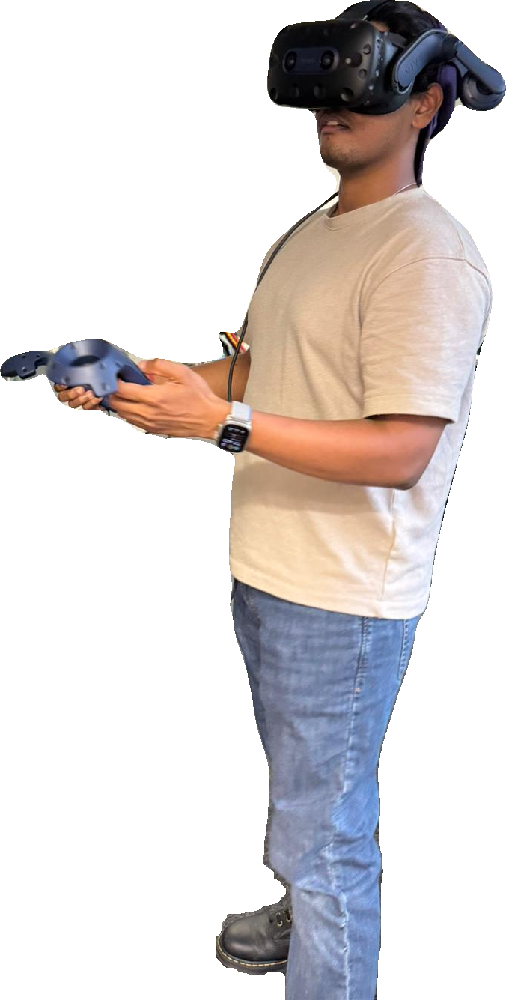

## 👋 Hi there, I'm Sundar

### Current Focus
Master's Thesis : Generative Data Visualization using Large Language Models <i>(Final Stage)</i>

### Skills
Software Engineering • Data Engineering • Machine Learning
• Cloud Native

### Languages
Python • SQL • Javascript • C++ • C#

  
  

